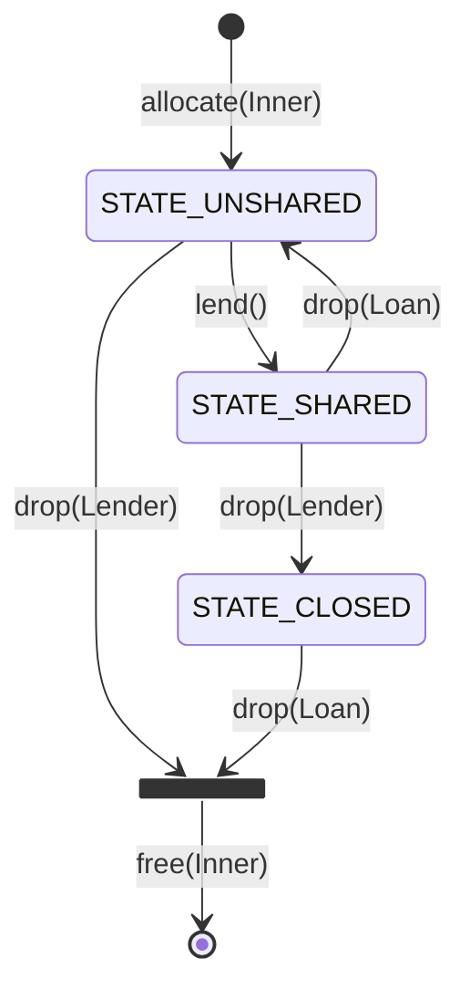

# Lender State Diagram

```mermaid
stateDiagram-v2
    state free <<join>>

    [*] --> STATE_UNSHARED: allocate(Inner)
    STATE_UNSHARED --> STATE_SHARED: lend()
    STATE_UNSHARED --> free: drop(Lender)
    STATE_SHARED  --> STATE_CLOSED: drop(Lender)
    STATE_SHARED --> STATE_UNSHARED: drop(Loan)
    STATE_CLOSED --> free: drop(Loan)
    free--> [*]: free(Inner)
```
